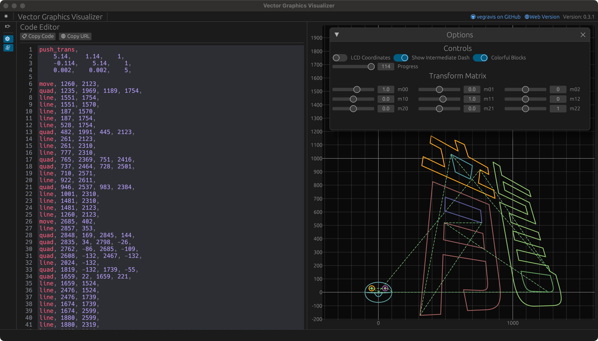

<div style="display: flex; justify-content: space-between; flex:8">
<h1 align="left">Vegravis</h1>

<div align="left">


<a href="https://jq.qq.com/?_wv=1027&k=8Z9w4LGN"></a>
<br>

<i>Vector Graphics Visualizer</i>

<a href="https://github.com/W-Mai/vegravis/stargazers"></a>
<a href="https://github.com/W-Mai/vegravis/network/members"></a>
<a href="https://github.com/W-Mai/vegravis/issues"></a>
<a href="https://github.com/W-Mai/vegravis/blob/master/LICENSE"></a>

</div>
</div>



## Introduction

Vegravis is a vector graphics visualizer.
It can visualize vector graphics on a canvas, and can also visualize vector graphics in other formats through
conversion.

like codes below:

```shell
// Sakaban Turtle
move, -100, 0,
quad, 0,-10,100, 0,
cubi, 100, -100, -100, -100, -100, 0,
cubi, -100, 100, 100, 100, 100, 0,
move, 70, 30,
cubi, 70, 55, 30, 55, 30, 30,
cubi, 30, 5, 70, 5, 70, 30,

move, 55, 30,
cubi, 55, 40, 45, 40, 45, 30,
cubi, 45, 20, 55, 20, 55, 30,

move, -70, 30,
cubi, -70, 55, -30, 55, -30, 30,
cubi, -30, 5, -70, 5, -70, 30,

move, -55, 30,
cubi, -55, 40, -45, 40, -45, 30,
cubi, -45, 20, -55, 20, -55, 30,

move, 30, -4,
quad, 0, -60, -30, -4
```

and you will get a cute Sakaban Turtle:


## Features

- [x] Visualize vector graphics
- [x] Support cross-platform (**Windows**, **Linux**, **MacOS**, **Web**)
- [ ] Support multiple vector graphics formats
- [ ] Support vector graphics editing
- [ ] Support vector graphics animation
- [x] Support custom vector grammar
- [x] Support custom vector grammar editor
- [x] Support grammar error detection
- [ ] ...

## LICENSE

MIT
